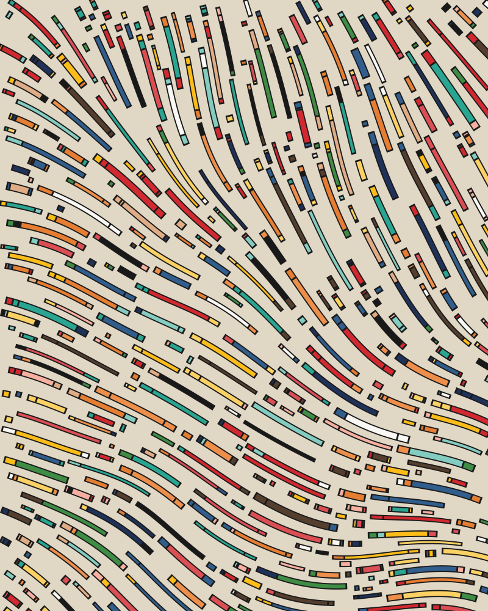

# Flow Field Generator (Fidenza-style)

16-step generative art algorithm with full parameter control.

## Example

Here's a sample composition generated with this tool (seed **223741039**):

<p align="center">
  
</p>

> If the image doesn't render above, [view the SVG directly](fidenza-223741039.svg).

## Quick Start

```bash
cd fidenza-app
npm install
npm run dev
```

Then open **http://localhost:5173** in Chrome.

## Your Saved Settings

Load seed **223741039** with these settings for your favorite composition:

| Setting | Value |
|---------|-------|
| Seed | 223741039 |
| Palette | Luxe (index 14) |
| Thickness Center | 6px |
| Thickness Spread | 3 |
| Thickness Variation | 62% |
| Min Floor | 3px |
| Global Mult | 1.00× |
| Gap / Spacing | 1.03 |
| Density | 1.45 |
| Fill Passes | 1 |
| Curve Length | 67 |
| Segment Probability | 90% |
| Min Segments | 2 |
| Max Segments | 4 |
| End Bias | 0.88 |
| Coherence | 0.61 |
| Outline | 1.9 |
| Turbulence | 1.2 |
| Octaves | 3 |
| Persistence | 0.41 |
| Angles | Smooth |
| Spiral | None |
| Stroke | Filled |

## Features

- **Save/Load Settings** — downloads a .json file with all your slider values
- **PNG Download** — works at any size, uses Blob API for large files
- **Hi-Res Render** — 2K, 4K, or 6×4ft print resolution
- **SVG Export** — vector output that scales infinitely for large-format printing
- **Generate via Claude** — AI-curated seed selection (requires API access)

## For Printing

1. Dial in your settings at preview size (800×1000)
2. Click **Export SVG** for vector output (best for large prints)
3. Or click **4K** / **6×4ft** for raster output
4. Send the .svg file to your print shop — it scales to any size with zero pixelation

## Requirements

- Node.js 18+
- npm
